## Unit 11 Submission File: Network Security Homework 

### Part 1: Review Questions 

#### Security Control Types

The concept of defense in depth can be broken down into three different security control types. Identify the security control type of each set  of defense tactics.

1. Walls, bollards, fences, guard dogs, cameras, and lighting are what type of security control?

    Answer: 
    
        Physical Control

2. Security awareness programs, BYOD policies, and ethical hiring practices are what type of security control?

    Answer: 
    
        Administrative Control

3. Encryption, biometric fingerprint readers, firewalls, endpoint security, and intrusion detection systems are what type of security control?

    Answer: 
    
        Technical Control

#### Intrusion Detection and Attack indicators

1. What's the difference between an IDS and an IPS?

    Answer: 
    
        IDS gives alerts but allows traffic to continue to flow. IPS can actually block and prevent traffic from coming into a system.

2. What's the difference between an Indicator of Attack and an Indicator of Compromise?

   Answer: 
   
        IOA is when there is indication that there is a attack. IOC is when there is indication that a breach has happened.

#### The Cyber Kill Chain

Name each of the seven stages for the Cyber Kill chain and provide a brief example of each.

1. Stage 1: 

        Reconnasissance. Examples: explores vulnerabilities, harvests login credentials

2. Stage 2: 

        Weaponization. Examples: setting up attacks to exploit vulnerabilities, setting up back doors

3. Stage 3: 

        Delivery. Examples: email attachments, malicious links

4. Stage 4: 

        Exploitation. Example: Randsomware is executed inside target system

5. Stage 5: 

        Installation. Example: other malware is can be installed onto the system

6. Stage 6: 

        Command and Control. Example: uses malware to control system

7. Stage 7: 

        Actions on Objective. Example: This is when the Randsomware notifies the target their files are encrypted


#### Snort Rule Analysis

Use the Snort rule to answer the following questions:

Snort Rule #1

```bash
alert tcp $EXTERNAL_NET any -> $HOME_NET 5800:5820 (msg:"ET SCAN Potential VNC Scan 5800-5820"; flags:S,12; threshold: type both, track by_src, count 5, seconds 60; reference:url,doc.emergingthreats.net/2002910; classtype:attempted-recon; sid:2002910; rev:5; metadata:created_at 2010_07_30, updated_at 2010_07_30;)
```

1. Break down the Sort Rule header and explain what is happening.

   Answer: 
   
        An external host (that was using any port) attempted to scan a local host on ports 5800-5820 using tcp

2. What stage of the Cyber Kill Chain does this alert violate?

   Answer: 
   
        Reconnaissance

3. What kind of attack is indicated?

   Answer: 
   
        Port Scanning or Port Mapping

Snort Rule #2

```bash
alert tcp $EXTERNAL_NET $HTTP_PORTS -> $HOME_NET any (msg:"ET POLICY PE EXE or DLL Windows file download HTTP"; flow:established,to_client; flowbits:isnotset,ET.http.binary; flowbits:isnotset,ET.INFO.WindowsUpdate; file_data; content:"MZ"; within:2; byte_jump:4,58,relative,little; content:"PE|00 00|"; distance:-64; within:4; flowbits:set,ET.http.binary; metadata: former_category POLICY; reference:url,doc.emergingthreats.net/bin/view/Main/2018959; classtype:policy-violation; sid:2018959; rev:4; metadata:created_at 2014_08_19, updated_at 2017_02_01;)
```

1. Break down the Sort Rule header and explain what is happening.

   Answer: 
   
        An extrnal host using http ports is accessing the local host on any port to either run or download an EXE or DLL file

2. What stage of the Cyber Kill Chain does this alert violate?

   Answer: 
   
        Delivery

3. What kind of attack is indicated?

   Answer: 
   
        This is difficult to answer without more information as multiple types of attacks could happen this way such as downloading of malware. This could also just be a random download from an untrusted source that isn't malicious.

Snort Rule #3

- Your turn! Write a Snort rule that alerts when traffic is detected inbound on port 4444 to the local network on any port. Be sure to include the `msg` in the Rule Option.

    Answer:
    
            alert tcp $EXTERNAL_NET 4444 -> $HOME_NET any (msg: "TCP packet traffic on 4444")

### Part 2: "Drop Zone" Lab

#### Log into the Azure `firewalld` machine

Log in using the following credentials:

- Username: `sysadmin`
- Password: `cybersecurity`

#### Uninstall `ufw`

Before getting started, you should verify that you do not have any instances of `ufw` running. This will avoid conflicts with your `firewalld` service. This also ensures that `firewalld` will be your default firewall.

- Run the command that removes any running instance of `ufw`.

        $ sudo apt -y remove ufw

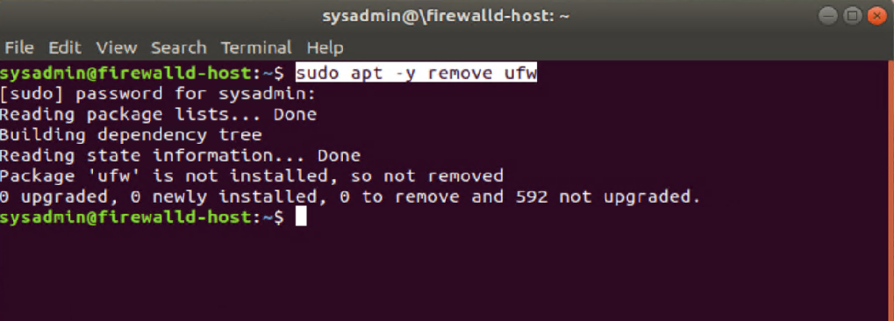
        


#### Enable and start `firewalld`

By default, these service should be running. If not, then run the following commands:

- Run the commands that enable and start `firewalld` upon boots and reboots.

        $ sudo systemctl enable firewalld
        $ sudo /etc/init.d/firewalld start

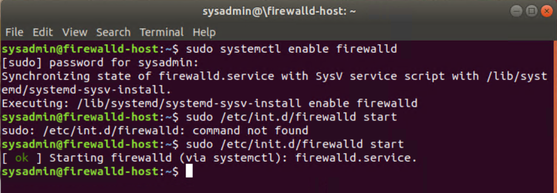
    

  Note: This will ensure that `firewalld` remains active after each reboot.

#### Confirm that the service is running.

- Run the command that checks whether or not the `firewalld` service is up and running.

        $ sudo systemctl status firewalld


#### List all firewall rules currently configured.

Next, lists all currently configured firewall rules. This will give you a good idea of what's currently configured and save you time in the long run by not doing double work.

- Run the command that lists all currently configured firewall rules:

        $ sudo firewall-cmd --list-all-zones
        or
        $ sudo firewall-cmd --get-zones

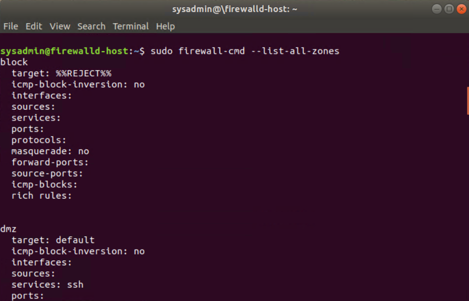


- Take note of what Zones and settings are configured. You many need to remove unneeded services and settings.

#### List all supported service types that can be enabled.

- Run the command that lists all currently supported services to see if the service you need is available

        $ sudo firewall-cmd --get-services

- We can see that the `Home` and `Drop` Zones are created by default.


#### Zone Views

- Run the command that lists all currently configured zones.

        $ sudo firewall-cmd --list-all-zones

- We can see that the `Public` and `Drop` Zones are created by default. Therefore, we will need to create Zones for `Web`, `Sales`, and `Mail`.

#### Create Zones for `Web`, `Sales` and `Mail`.

- Run the commands that creates Web, Sales and Mail zones.

        $ sudo firewall-cmd --permanent --new-zone=web 
        $ sudo firewall-cmd --permanent --new-zone=sales
        $ sudo firewall-cmd --permanent --new-zone=mail

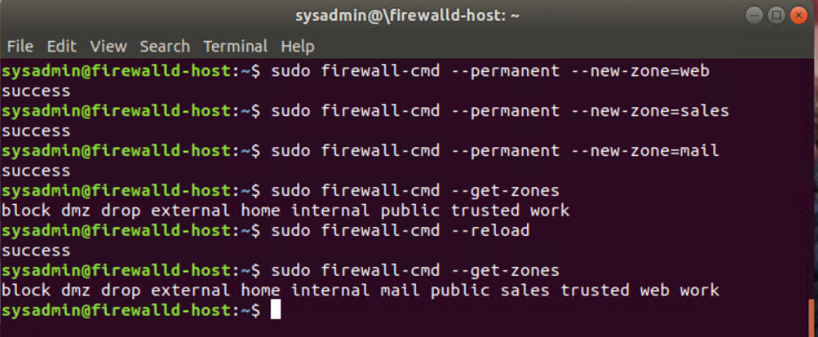

#### Set the zones to their designated interfaces:

- Run the commands that sets your `eth` interfaces to your zones.

        $ sudo firewall-cmd --zone=public --change-interface=eth0
        $ sudo firewall-cmd --zone=web --change-interface=eth1
        $ sudo firewall-cmd --zone=sales --change-interface=eth2
        $ sudo firewall-cmd --zone=mail --change-interface=eth3


#### Add services to the active zones:

- Run the commands that add services to the **public** zone, the **web** zone, the **sales** zone, and the **mail** zone.

- Public:

        $ sudo firewall-cmd --zone=public --add-service=http
        $ sudo firewall-cmd --zone=public --add-service=https
        $ sudo firewall-cmd --zone=public --add-service=pop3
        $ sudo firewall-cmd --zone=public --add-service=smtp
    

- Web:

        $ sudo firewall-cmd --zone=web --add-service=http
    

- Sales

        $ sudo firewall-cmd --zone=sales --add-service=https

- Mail

        $ sudo firewall-cmd --zone=mail --add-service=pop3
        $ sudo firewall-cmd --zone=mail --add-service=smtp

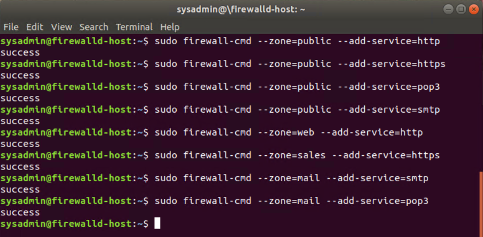

- What is the status of `http`, `https`, `smtp` and `pop3`?

        Added to appropriate zones but only temporaly active

#### Add your adversaries to the Drop Zone.

- Run the command that will add all current and any future blacklisted IPs to the Drop Zone.

        $ sudo firewall-cmd --zone=drop --add-source=10.208.56.23
        $ sudo firewall-cmd --zone=drop --add-source=135.95.103.76
        $ sudo firewall-cmd --zone=drop --add-source=76.34.169.118


#### Make rules permanent then reload them:

It's good practice to ensure that your `firewalld` installation remains nailed up and retains its services across reboots. This ensure that the network remains secured after unplanned outages such as power failures.

- Run the command that reloads the `firewalld` configurations and writes it to memory

        $ sudo firewall-cmd --runtime-to-permanent

#### View active Zones

Now, we'll want to provide truncated listings of all currently **active** zones. This a good time to verify your zone settings.

- Run the command that displays all zone services.

        $ sudo firewall-cmd --get-active-zones

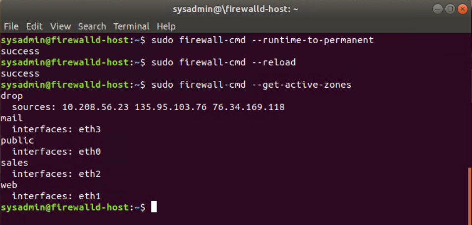


#### Block an IP address

- Use a rich-rule that blocks the IP address `138.138.0.3`.

        $ sudo firewall-cmd --permanent --zone=public --add-rich-rule="rule family='ipv4' source address='138.138.0.3' reject"


#### Block Ping/ICMP Requests

Harden your network against `ping` scans by blocking `icmp ehco` replies.

- Run the command that blocks `pings` and `icmp` requests in your `public` zone.

        $ sudo firewall-cmd --permanent --zone=public --add-icmp-block=echo-reply --add-icmp-block=echo-request

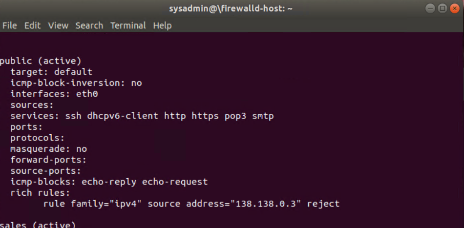


#### Rule Check

Now that you've set up your brand new `firewalld` installation, it's time to verify that all of the settings have taken effect.

- Run the command that lists all  of the rule settings. Do one command at a time for each zone.

        $ sudo firewall-cmd --zone=public --list-all
        $ sudo firewall-cmd --zone=drop --list-all
        $ sudo firewall-cmd --zone=mail --list-all
        $ sudo firewall-cmd --zone=sales --list-all
        $ sudo firewall-cmd --zone=web --list-all

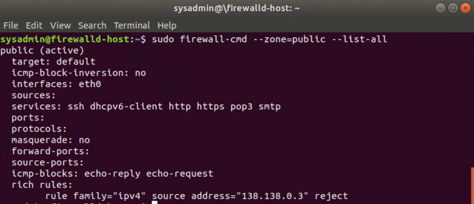
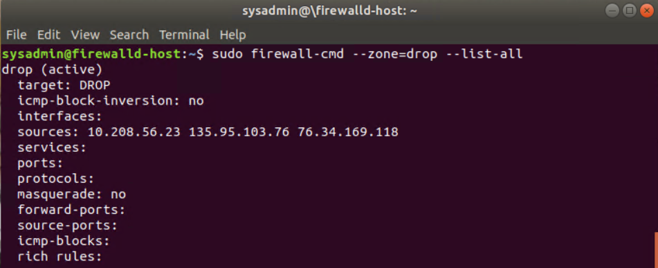
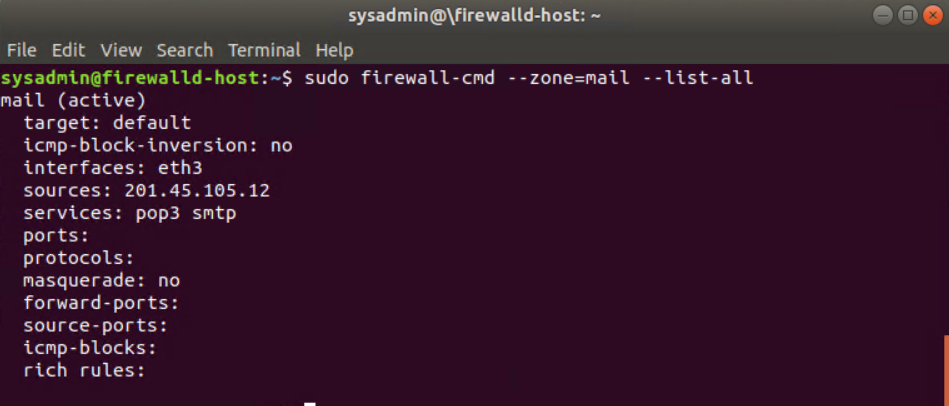

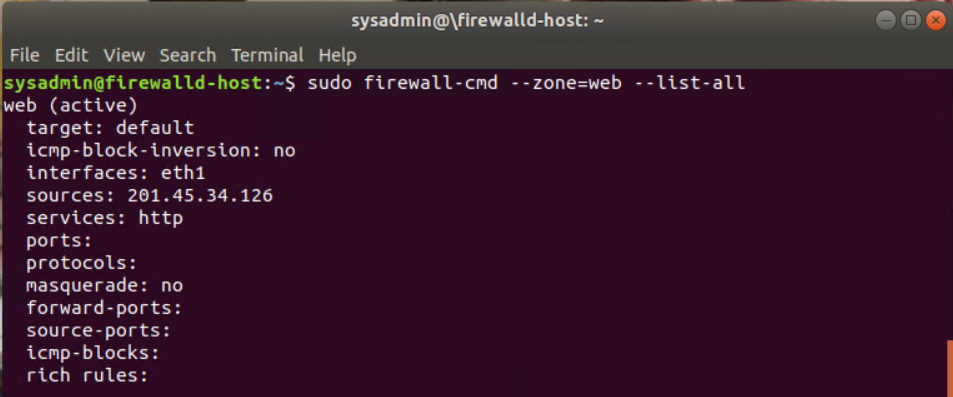

- Are all of our rules in place? If not, then go back and make the necessary modifications before checking again.


Congratulations! You have successfully configured and deployed a fully comprehensive `firewalld` installation.

---

### Part 3: IDS, IPS, DiD and Firewalls

Now, we will work on another lab. Before you start, complete the following review questions.

#### IDS vs. IPS Systems

1. Name and define two ways an IDS connects to a network.

   Answer 1: 

        NIDS (Network IDS) : designed to monitor the network traffic

   Answer 2:

        HIDS (Host IDS) : designed to motitor important system files

2. Describe how an IPS connects to a network.

   Answer:

        An IPS connects to a network directly through a network tap or Test Access Port

3. What type of IDS compares patterns of traffic to predefined signatures and is unable to detect Zero-Day attacks?

   Answer:

        Signature-based

4. Which type of IDS is beneficial for detecting all suspicious traffic that deviates from the well-known baseline and is excellent at detecting when an attacker probes or sweeps a network?

   Answer:

        Anomaly-based

#### Defense in Depth

1. For each of the following scenarios, provide the layer of Defense in Depth that applies:

    1.  A criminal hacker tailgates an employee through an exterior door into a secured facility, explaining that they forgot their badge at home.

        Answer:

            Physical control layer

    2. A zero-day goes undetected by antivirus software.

        Answer:

            Technical software control layer

    3. A criminal successfully gains access to HR’s database.

        Answer:

            Technical network control layer

    4. A criminal hacker exploits a vulnerability within an operating system.

        Answer:

            Technical software control layer

    5. A hacktivist organization successfully performs a DDoS attack, taking down a government website.

        Answer:

            Techinal network control layer

    6. Data is classified at the wrong classification level.

        Answer:

            Administrative procedure control layer

    7. A state sponsored hacker group successfully firewalked an organization to produce a list of active services on an email server.

        Answer:

            Techincal network control layer

2. Name one method of protecting data-at-rest from being readable on hard drive.

    Answer:

        Hard drive encryption

3. Name one method to protect data-in-transit.

    Answer:

        Data encryption

4. What technology could provide law enforcement with the ability to track and recover a stolen laptop.

   Answer:

        IP tracking and tracing but needs a supeona to ISPs in order to pin down where the IP is located. A GPS receiver on the laptop is more practical.

5. How could you prevent an attacker from booting a stolen laptop using an external hard drive?

    Answer:

        Hard disk encryption. Also changing the BIOS to only boot from internal drives would prevent this.


#### Firewall Architectures and Methodologies

1. Which type of firewall verifies the three-way TCP handshake? TCP handshake checks are designed to ensure that session packets are from legitimate sources.

  Answer:

        Stateful firewall

2. Which type of firewall considers the connection as a whole? Meaning, instead of looking at only individual packets, these firewalls look at whole streams of packets at one time.

  Answer:

        Again, the stateful firewall would apply here

3. Which type of firewall intercepts all traffic prior to being forwarded to its final destination. In a sense, these firewalls act on behalf of the recipient by ensuring the traffic is safe prior to forwarding it?

  Answer: 
  
        Circuit-level gateway


4. Which type of firewall examines data within a packet as it progresses through a network interface by examining source and destination IP address, port number, and packet type- all without opening the packet to inspect its contents?

  Answer:

        Packet filtering firewall


5. Which type of firewall filters based solely on source and destination MAC address?

  Answer:

        MAC layer or media access control layer firewall


### Bonus Lab: "Green Eggs & SPAM"
In this activity, you will target spam, uncover its whereabouts, and attempt to discover the intent of the attacker.
 
- You will assume the role of a Jr. Security administrator working for the Department of Technology for the State of California.
 
- As a junior administrator, your primary role is to perform the initial triage of alert data: the initial investigation and analysis followed by an escalation of high priority alerts to senior incident handlers for further review.
 
- You will work as part of a Computer and Incident Response Team (CIRT), responsible for compiling **Threat Intelligence** as part of your incident report.

#### Threat Intelligence Card

**Note**: Log into the Security Onion VM and use the following **Indicator of Attack** to complete this portion of the homework. 

Locate the following Indicator of Attack in Sguil based off of the following:

- **Source IP/Port**: `188.124.9.56:80`
- **Destination Address/Port**: `192.168.3.35:1035`
- **Event Message**: `ET TROJAN JS/Nemucod.M.gen downloading EXE payload`

Answer the following:

1. What was the indicator of an attack?
   - Hint: What do the details of the reveal? 

    Answer: 

        Details reveal it was a trojan attack
        alert tcp $EXTERNAL_NET $HTTP_PORTS -> $HOME_NET any (msg:"ET TROJAN JS/Nemucod.M.gen downloading EXE payload)


2. What was the adversarial motivation (purpose of attack)?

    Answer: 

        They are trying to gain remote access of computers. It looks like they are after data to steal.

3. Describe observations and indicators that may be related to the perpetrators of the intrusion. Categorize your insights according to the appropriate stage of the cyber kill chain, as structured in the following table.

| TTP | Example | Findings |
| --- | --- | --- | 
| **Reconnaissance** |  How did they attacker locate the victim? | Emails were sent out in a broad campaign. Luck of the draw maybe.
| **Weaponization** |  What was it that was downloaded?| A zipfile
| **Delivery** |    How was it downloaded?| It was attached to the email
| **Exploitation** |  What does the exploit do?| It runs an excutable in the background while the victim thinks they are reading a real PDF file
| **Installation** | How is the exploit installed?| It's installed when the unzip the file which then install a script and an EXE
| **Command & Control (C2)** | How does the attacker gain control of the remote machine?| The executable files are used to get a Trojan downloader which installs more executables containing and infostealer.
| **Actions on Objectives** | What does the software that the attacker sent do to complete it's tasks?| After reboot it starts to phone home with it's intended executables and information they are probably after.


4. What are your recommended mitigation strategies?


    Answer: 

        A couple of mitigations could be applied here. The IP address of the attacker can be outright blocked to prevent access to the network. Training employees not to open zipfiles unless prior knowledge of the file arriving (like conversations with your boss or co-worker and they said they will be sending a file). Anti-virus software installed on the network or host comptuer would also be a needed mitigation.


5. List your third-party references.

    Answer: 

        https://certego.net/en/news/italian-spam-campaigns-using-js-nemucod-downloader/

        https://www.f-secure.com/v-descs/trojan-downloader_js_nemucod.shtml


---

© 2020 Trilogy Education Services, a 2U, Inc. brand. All Rights Reserved.
