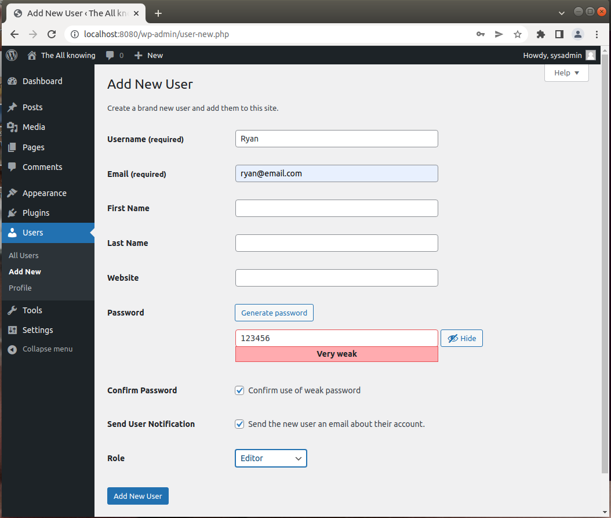
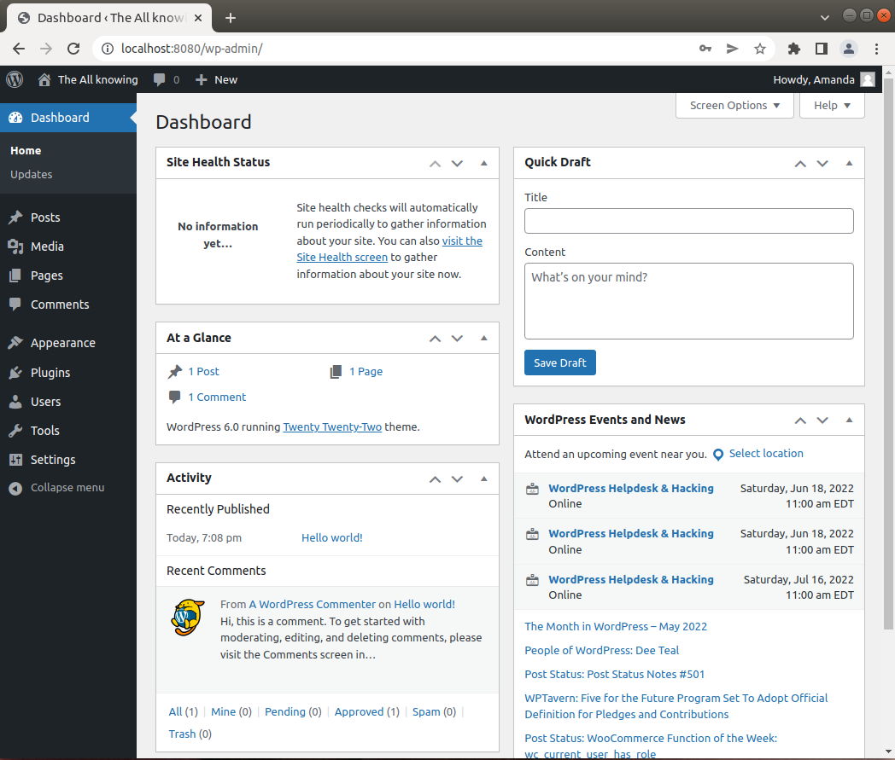
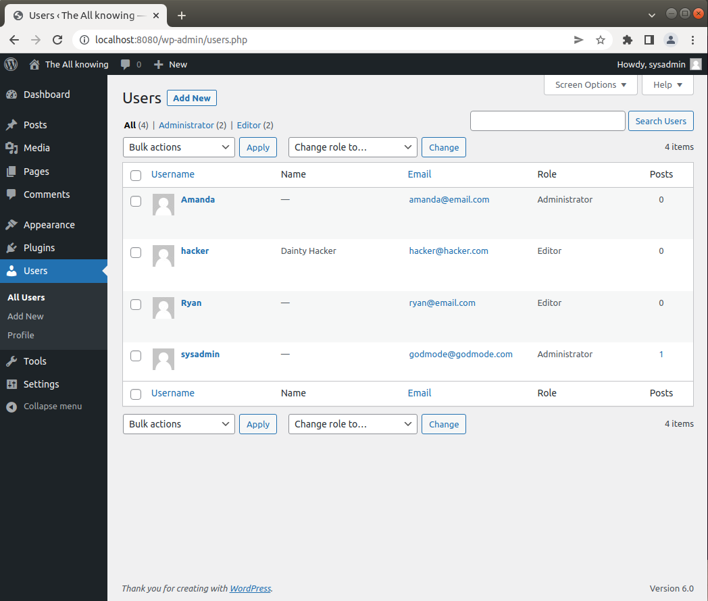
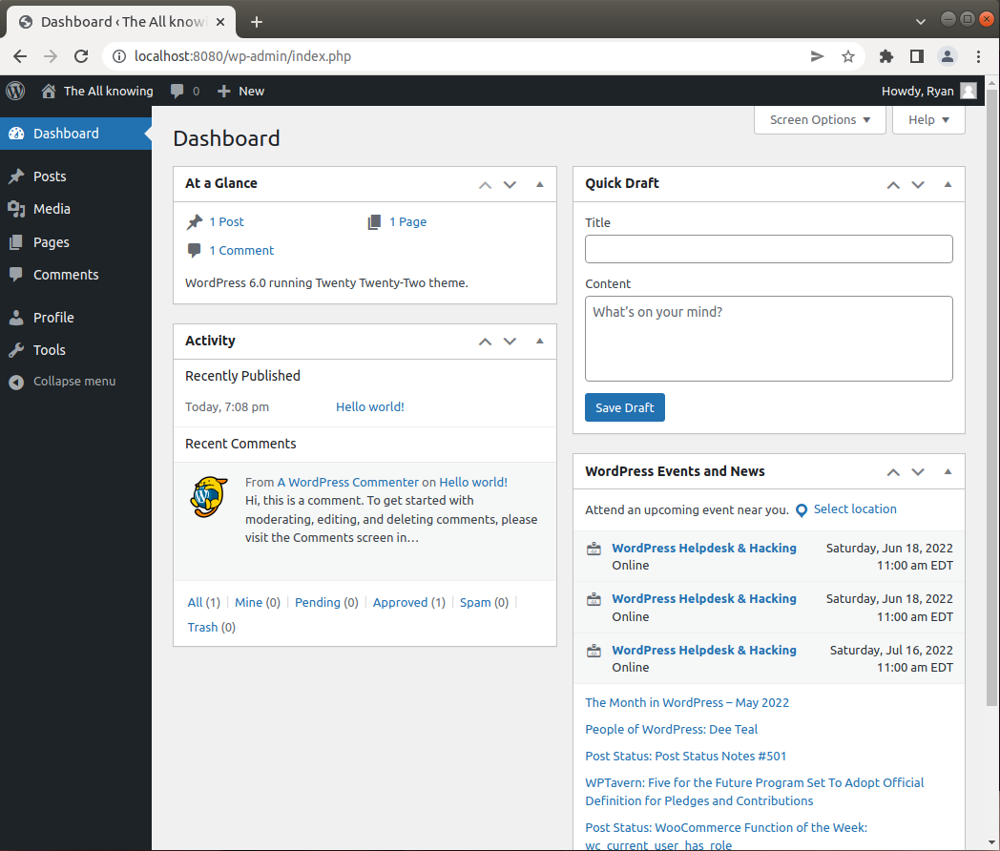
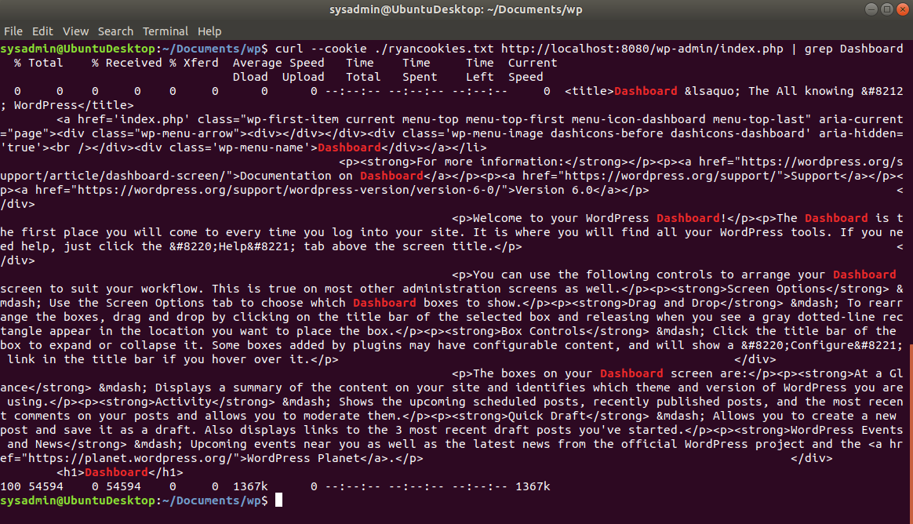
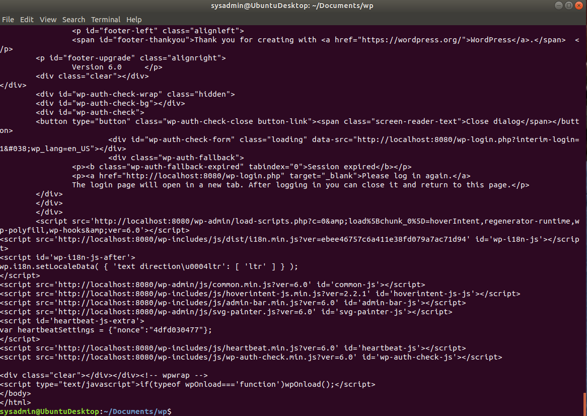

# Unit 12 Submission File: Web Development 

---
## Questions 

Before you work through the questions below, please creat a new file and record your answers there. This will be your homework deliverable.

## HTTP Requests and Responses

Answer the following questions about the HTTP request and response process.

1. What type of architecture does the HTTP request and response process occur in?

        HTTP is based on the client-server architecture

2. What are the different parts of an HTTP request?

        HTTP requests consist of:
        Methods (examples are GET, HEAD, POST) 
        Headers (examples are Authorization, Cookie)
        Bodies

3. Which part of an HTTP request is optional?

        The body is an option part of the HTTP request

4. What are the three parts of an HTTP response?

        HTTP response consist of:
        Status Codes (example: 200 OK)
        Headers (examples are Connection, Set-Cookie)
        Bodies

5. Which number class of status codes represents errors?

        Depends on the type of errors
        400 codes are client errors
        500 codes are for server errors

6. What are the two most common request methods that a security professional will encounter?

        GET and POST are the two most common.

7. Which type of HTTP request method is used for sending data?

        The POST request is used for sending data

8. Which part of an HTTP request contains the data being sent to the server?

        The body of a HTTP request contains the data to be sent

9. In which part of an HTTP response does the browser receive the web code to generate and style a web page?

        Much like the request, the body of the response is where the web code lies.

## Using Curl

Answer the following questions about curl:

10. What are the advantages of using curl over the browser?

        Curl allows us to access a webserver or database when there is no UI or links available to do so.

11. Which curl option is used to change the request method?

        --request is used

12. Which curl option is used to set request headers?

        -H is used to set request headers

13. Which curl option is used to view the response header?

        -v or -verbose can be used
        curl --head can be used to display only the response header

14. Which request method might an attacker use to figure out which HTTP requests an HTTP server will accept?

        OPTIONS as this gives the different type of communication options available

## Sessions and Cookies

Recall that HTTP servers need to be able to recognize clients from one another. They do this through sessions and cookies.

Answer the following questions about sessions and cookies:

15. Which response header sends a cookie to the client?

        HTTP/1.1 200 OK
        Content-type: text/html
        Set-Cookie: cart=Bob
- Answer:

        Set_Cookie: cart=Bob

16. Which request header will continue the client's session?

        GET /cart HTTP/1.1
        Host: www.example.org
        Cookie: cart=Bob
- Answer:

        Cookie: cart=Bob

## Example HTTP Requests and Responses

Look through the following example HTTP request and response and answer the following questions:

### HTTP Request

        POST /login.php HTTP/1.1
        Host: example.com
        Accept-Encoding: gzip, deflate, br
        Connection: keep-alive
        Content-Type: application/x-www-form-urlencoded
        Content-Length: 34
        Upgrade-Insecure-Requests: 1
        User-Agent: Mozilla/5.0 (Linux; Android 6.0; Nexus 5 Build/MRA58N) AppleWebKit/537.36 (KHTML, like Gecko) Chrome/80.0.3987.132 Mobile Safari/537.36

        username=Barbara&password=password

17. What is the request method?

        POST is the request method

18. Which header expresses the client's preference for an encrypted response?

        Upgrade-Insecure-Requests: 1

19. Does the request have a user session associated with it?

        No as there are no cookie requests in this header

20. What kind of data is being sent from this request body?

        Login information (username and password)

### HTTP Response

        HTTP/1.1 200 OK
        Date: Mon, 16 Mar 2020 17:05:43 GMT
        Last-Modified: Sat, 01 Feb 2020 00:00:00 GMT
        Content-Encoding: gzip
        Expires: Fri, 01 May 2020 00:00:00 GMT
        Server: Apache
        Set-Cookie: SessionID=5
        Content-Type: text/html; charset=UTF-8
        Strict-Transport-Security: max-age=31536000; includeSubDomains
        X-Content-Type: NoSniff
        X-Frame-Options: DENY
        X-XSS-Protection: 1; mode=block

        [page content]

21. What is the response status code?

        200 OK (this means it was successful)

22. What web server is handling this HTTP response?

        Apache

23. Does this response have a user session associated to it?

        Yes it does
        Set-Cookie: SessionID=5

24. What kind of content is likely to be in the [page content] response body?

        It'll be what's in the url that this request had asked for.

25. If your class covered security headers, what security request headers have been included?

        X-Content-Type: NoSniff - prevents the client from "sniffing" the asset to determie if the file type is different than declared

        X-Frame-Options: DENY - prevents the use of the current page in a frame

        X-XSS-Protection: 1; mode=block - this enables XSS filtering and specifically prevents rendering of the page if an attack is detected

## Monoliths and Microservices

Answer the following questions about monoliths and microservices:

26. What are the individual components of microservices called?

        Front-end server
        Back-end server
        Database

27. What is a service that writes to a database and communicates to other services?

        An API. It implements new protocols and features to existing data and software.

28. What type of underlying technology allows for microservices to become scalable and have redundancy?

        Load balancing allows for scaling and redundancy

## Deploying and Testing a Container Set

Answer the following questions about multi-container deployment:

29. What tool can be used to deploy multiple containers at once?

        Docker Compose

30. What kind of file format is required for us to deploy a container set?

        A YAML file which goes by the .yml extension
        
## Databases

31. Which type of SQL query would we use to see all of the information within a table called customers?

        SELECT * FROM customers

32. Which type of SQL query would we use to enter new data into a table? (You don't need a full query, just the first part of the statement.)

        INSERT INTO

33. Why would we never run DELETE FROM <table-name>; by itself?

        If you use that you'll delete the entire table.

---

## Bonus Challenge Instructions: The Cookie Jar

First, using Docker Compose, navigate to the Day 1 WordPress activity directory and bring up the container set:

/home/sysadmin/Documents/docker_files

Using curl, you will do the following for the Ryan user:

Log into WordPress and save the user's cookies to a cookie jar.

Test a WordPress page by using a cookie from the cookie jar.

Pipe the output from the cookie with grep to check for authenticated page access.

Attempt to access a privileged WordPress admin page.

## Step 1: Set Up

Create two new users: Amanda and Ryan.

1. Navigate to localhost:8080/wp-admin/

2. On the left-hand toolbar, hover over Users and click Add New.

3. Enter the following information to create the new user named Amanda.

- Username: Amanda
- Email: amanda@email.com

4. Skip down to password:

- Password: password
- Confirm Password: Check the box to confirm use of weak password.
- Role: Administrator

![p[c]](Images/Amanda.PNG)

5. Create another user named Ryan.

- Username: Ryan
- Email: ryan@email.com

6. Skip down to password:

- Password: 123456
- Confirm Password: Check the box to confirm use of weak password.
- Role: Editor

7. Log out and log in with the following credentials:

- Username: Amanda
- Password: password

## Step 2: Baselining

For these "baselining" steps, you'll want to log into two different types of accounts to see how the WordPress site looks at the localhost:8080/wp-admin/users.php page.  We want to see how the Users page looks from the perspective of an administrator, vs. a regular user.

1. Using your browser, log into your WordPress site as your sysadmin account and navigate to localhost:8080/wp-admin/users.php, where we previously created the user Ryan. Examine this page briefly. Log out.

2. Using your browser, log into your Ryan account and attempt to navigate to localhost:8080/wp-admin/index.php. Note the wording on your Dashboard.

3. Attempt to navigate to localhost:8080/wp-admin/users.php. Note what you see now.

Log out in the browser.

## Step 3: Using Forms and a Cookie Jar

Navigate to ~/Documents in a terminal to save your cookies.

1. Construct a curl request that enters two forms: "log={username}" and "pwd={password}" and goes to http://localhost:8080/wp-login.php. Enter Ryan's credentials where there are placeholders.

        curl --form "log=Ryan" --form "pwd=123456" http://localhost:8080/wp-login.php

- Question: Did you see any obvious confirmation of a login? (Y/N)

        No

2. Construct the same curl request, but this time add the option and path to save your cookie: --cookie-jar ./ryancookies.txt. This option tells curl to save the cookies to the ryancookies.txt text file.

        curl --cookie-jar ./ryancookies.txt --form "log=Ryan" --form "pwd=123456" http://localhost:8080/wp-login.php

3. Read the contents of the ryancookies.txt file.

- Question: How many items exist in this file?

        Three items

Note that each one of these is a cookie that was granted to Ryan after logging in.

## Step 4: Log in Using Cookies

1. Craft a new curl command that now uses the --cookie option, followed by the path to your cookies file. For the URL, use http://localhost:8080/wp-admin/index.php.

        curl --cookie ./ryancookies.txt http://localhost:8080/wp-admin/index.php

- Question: Is it obvious that we can access the Dashboard? (Y/N)

        Not at first if you don't know what you are looking for. But you can if you scroll back far enough.

2. Press the up arrow on your keyboard to run the same command, but this time, pipe | grep Dashboard to the end of your command to return all instances of the word Dashboard on the page.

        curl --cookie ./ryancookies.txt http://localhost:8080/wp-admin/index.php | grep Dashboard

- Question:  Look through the output where Dashboard is highlighted. Does any of the wording on this page seem familiar? (Y/N) If so, you should be successfully logged in to your Editor's dashboard.

        Yes it does look familiar like the wording on the UI.

## Step 5: Test the Users.php Page

1. Finally, write a curl command using the same --cookie ryancookies.txt option, but attempt to access http://localhost:8080/wp-admin/users.php.

        curl --cookie ./ryancookies.txt http://localhost:8080/wp-admin/users.php

- Question: What happens this time?

        Access was still denied as Ryan doesn't have admin access to this page. Amanda does however.

        curl --cookie ./amandacookies.txt http://localhost:8080/wp-admin/users.php

---

© 2020 Trilogy Education Services, a 2U, Inc. brand. All Rights Reserved.
