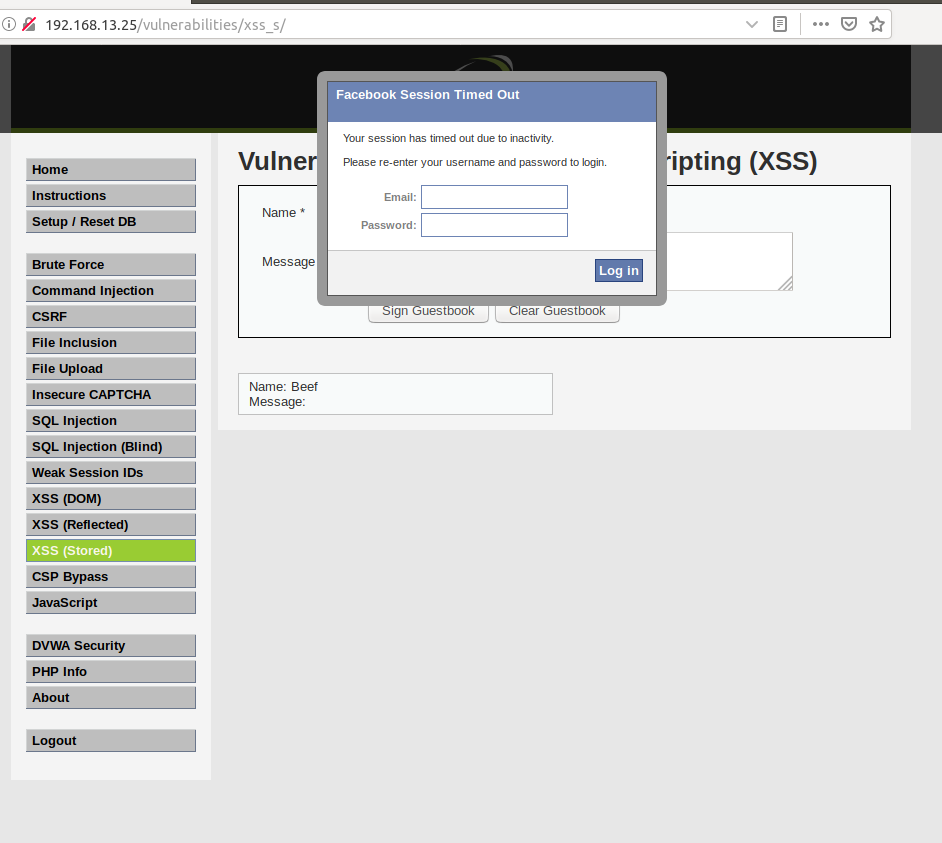

# Unit 15 Homework

## Overview

In this homework scenario, you will continue as an application security engineer at Replicants. Replicants created several new web applications and would like you to continue testing them for vulnerabilities. Additionally, your manager would like you to research and test a security tool called **BeEF** in order to understand the impact it could have on the organization if Replicants was targeted with this tool. 

### Lab Environment

You will continue to use your Vagrant virtual machine for this assignment.

### Topics Covered in Your Assignment

- Web application vulnerability assessments
- Injection
- Brute force attacks
- Broken authentication
- Burp Suite
- Web proxies
- Directory traversal
- Dot dot slash attacks
- Beef
- Cross-site scripting
- Malicious payloads

---

## Instructions

In this assignment, you will test three web application vulnerabilities. For each vulnerability you will be provided with the following:

  - Steps detailing how to set up and access the application.

  - A walkthrough explaining how the application is intended to work.

  - A task that will test the application for vulnerabilities.

Your goal is to determine if the application is vulnerable and provide mitigations.

### Submission Guidelines

You will submit a document (Word or Google Docs) that contains the following for each web application: 

- Screen shots confirming the successful exploit.

- Two to three sentences detailing recommended mitigation strategies. 

When complete, submit the file on BCS.   

---

## Web Application 1: *Your Wish is My Command Injection*

**Deliverable**: Take a screenshot confirming that this exploit was successfully executed and provide 2-3 sentences outlining mitigation strategies. 

    There are multiple ways to mitigate against this. For starters is to not allow the site to accept system commands from user input.
    If it is absolutely needed to do so, you can whitelist commands to only accept their input strings. 
    You can also limit what types of characters are accepted. 
    In this instance, by not allowing special characters, using "&&" would not allow the injection to happen.

---

## Web Application 2: *A Brute Force to Be Reckoned With*

**Deliverable**: Take a screenshot confirming that this exploit was successfully executed and provide 2-3 sentences outlining mitigation strategies. 

    The best way to mitigate against this is to prevent users from using previous passwords from the same list provided. 
    Another option is to have a password management system where passwords are forced to change after a certain time frame and that previous passwords can't be reused (or at least can't be used again after 5 or 6 different passwords). 
    Two factor authentication is yet another strategy against this cause even if the hacker has the password, they would need the second verification to access the site.

---

## Web Application 3: *Where's the BeEF?*

**Deliverable**: Take a screenshot confirming that this exploit was successfully executed and provide 2-3 sentences outlining mitigation strategies. 

    The number one way to prevent cross site scripting is to prohibit HTML code inputs. 
    Having input validators is also extremely helpful in preventing XSS.
    Similar to validation, sanitizing the date before it gets executed is another option to prevent this type of attack. 
    One other option is using a Web Application Firewall that can specifically block XSS by blocking abnormal server requests.
---

© 2021 Trilogy Education Services, a 2U, Inc. brand. All Rights Reserved.
