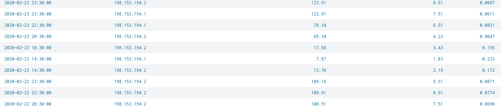
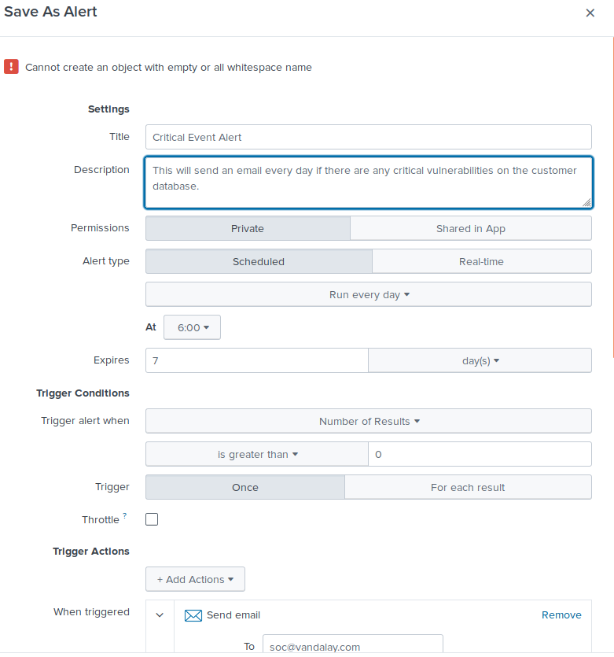
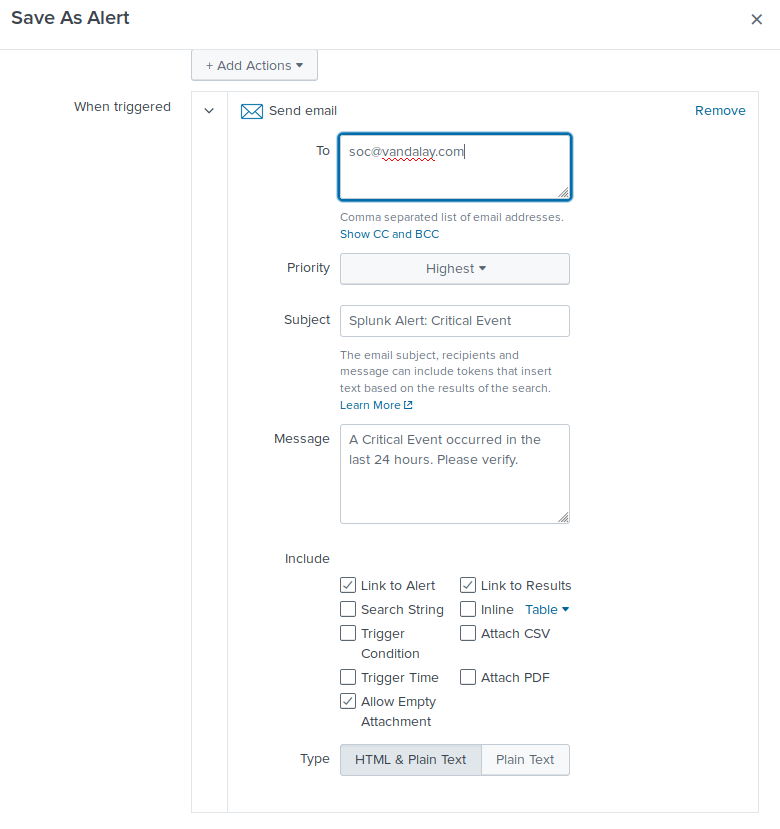

# Unit 20 Homework: Lets go Splunking!

---

## Vandalay Industries Monitoring Activity Instructions

## Step 1: The Need for Speed 

**Task:** Create a report to determine the impact that the DDOS attack had on download and upload speed. Additionally, create an additional field to calculate the ratio of the upload speed to the download speed.

1. Using the `eval` command, create a field called `ratio` that shows the ratio between the upload and download speeds.

      
2. Create a report using the Splunk's `table` command to display the following fields in a statistics report:
    - `_time`
    - `IP_ADDRESS`
    - `DOWNLOAD_MEGABITS`
    - `UPLOAD_MEGABITS`
    - `ratio`

3. Answer the following questions:

- Based on the report created, what is the approximate date and time of the attack?

      Based on the report the attacked happened between 14:30 and 18:30 on 2-23-2020

- How long did it take your systems to recover?

      It took the systems apporximately 5 hours to recover
 
## Step 2: Are We Vulnerable? 

**Task:** Create a report determining how many critical vulnerabilities exist on the customer data server. Then, build an alert to notify your team if a critical vulnerability reappears on this server.

1. Create a report that shows the `count` of critical vulnerabilities from the customer database server.
   - The database server IP is `10.11.36.23`.
   - The field that identifies the level of vulnerabilities is `severity`.

      
2. Build an alert that monitors every day to see if this server has any critical vulnerabilities. If a vulnerability exists, have an alert emailed to `soc@vandalay.com`.

## Step 3: Drawing the (base)line

**Task:** Analyze administrator logs that document a brute force attack. Then, create a baseline of the ordinary amount of administrator bad logins and determine a threshold to indicate if a brute force attack is occurring.

1. When did the brute force attack occur?

       The Brute Force Attack occurred between 8AM and 3PM as there was a large spike in failed login attempts. (see screenshots below)

      
2. Determine a baseline of normal activity and a threshold that would alert if a brute force attack is occurring.

       Based on the date provided, we determined that a baseline of 30 would be as the highest number of failed attempts outside of the attack window were under 25.

3. Design an alert to check the threshold every hour and email the SOC team at SOC@vandalay.com if triggered. 

 
---

© 2020 Trilogy Education Services, a 2U, Inc. brand. All Rights Reserved.
