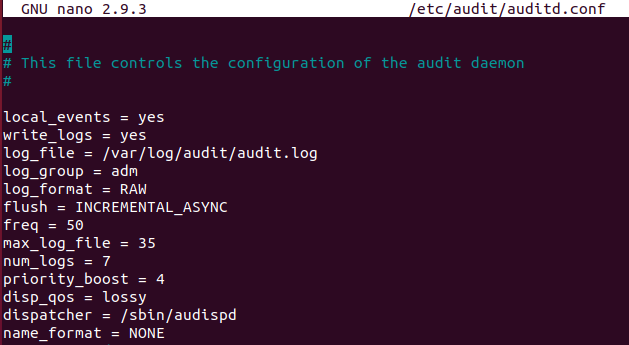

## Week 5 Homework Submission File: Archiving and Logging Data

Please edit this file by adding the solution commands on the line below the prompt.

Save and submit the completed file for your homework submission.

---

### Step 1: Create, Extract, Compress, and Manage tar Backup Archives

1. Command to **extract** the `TarDocs.tar` archive to the current directory:

        tar -xvf TarDocs.tar -C ~/Projects

2. Command to **create** the `Javaless_Doc.tar` archive from the `TarDocs/` directory, while excluding the `TarDocs/Documents/Java` directory:

        tar -cvf Javaless_Docs.tar --exclude=/home/sysadmin/Projects/TarDocs/Documents/Java ~/Projects/TarDocs/Documents/

    **NOTE:** this is the only command line i was able to get it to work properly DESPITE all documentation in our gitlab stating otherwise

3. Command to ensure `Java/` is not in the new `Javaless_Docs.tar` archive:

        tar -tf Javaless_Docs.tar | grep Java

    

**Bonus** 
- Command to create an incremental archive called `logs_backup.tar.gz` with only changed files to `snapshot.file` for the `/var/log` directory:

        tar --listed-incremental=snapshot.file -cvzf logs.backup.tar.gz /var/log

#### Critical Analysis Question

- Why wouldn't you use the options `-x` and `-c` at the same time with `tar`?

        -x is used to extract from tar while -c is used to create a tar

---

### Step 2: Create, Manage, and Automate Cron Jobs

1. Cron job for backing up the `/var/log/auth.log` file:

        0 6 * * 3 sudo tar -czvf auth_backup.tgz var/log/auth.log

    

---

### Step 3: Write Basic Bash Scripts

1. Brace expansion command to create the four subdirectories:

        mkdir ~/backups/{freemem,diskuse,openlist,freedisk}

2. Paste your `system.sh` script edits below:

    

3. Command to make the `system.sh` script executable:

        sudo chmod +x system.sh

**Optional**
- Commands to test the script and confirm its execution:

        cat ~/backups/freemem/free_mem.txt
        cat ~/backups/diskuse/disk_usage.txt
        cat ~/backups/openlist/open_list.txt
        cat ~/backups/freedisk/free_disk.txt

    
    
    

**Bonus**
- Command to copy `system` to system-wide cron directory:

        sudo cp system.sh /etc/cron.weekly

---

### Step 4. Manage Log File Sizes
 
1. Run `sudo nano /etc/logrotate.conf` to edit the `logrotate` configuration file. 

    Configure a log rotation scheme that backs up authentication messages to the `/var/log/auth.log`.

    - Add your config file edits below:

    ```bash
    /var/log/auth.log {
    weekly
    rotate 7
    notifempty
    delaycompress
    missingok
    endscript
    }

    ```
    
---

### Bonus: Check for Policy and File Violations

1. Command to verify `auditd` is active:

         systemctl status auditd

2. Command to set number of retained logs and maximum log file size:

    - Add the edits made to the configuration file below:

    ```bash
    max_log_file = 35
    num_logs = 7
    ```
    

3. Command using `auditd` to set rules for `/etc/shadow`, `/etc/passwd` and `/var/log/auth.log`:

        sudo nano /etc/audit/rules.d/audit.rules


    - Add the edits made to the `rules` file below:

    ```bash
    -w /etc/shadow -p wra -k hashpass_audit
    -w /etc/passwd -p wra -k userpass_audit
    -w /var/log/auth.log -p wra -k authlog_audit
    ```
    

4. Command to restart `auditd`:

        sudo systemctl restart auditd

5. Command to list all `auditd` rules:

        sudo auditctl -l

6. Command to produce an audit report:

        sudo aureport -au

7. Create a user with `sudo useradd attacker` and produce an audit report that lists account modifications:

    

8. Command to use `auditd` to watch `/var/log/cron`:

        sudo auditctl -w /var/log/cron

9. Command to verify `auditd` rules:

    

---

### Bonus (Research Activity): Perform Various Log Filtering Techniques

1. Command to return `journalctl` messages with priorities from emergency to error:

        sudo journalctl -p 3

1. Command to check the disk usage of the system journal unit since the most recent boot:

        sudo journalctl -b -u  systemd-journald

1. Comand to remove all archived journal files except the most recent two:

        sudo journalctl --vacuum-files=2


1. Command to filter all log messages with priority levels between zero and two, and save output to `/home/sysadmin/Priority_High.txt`:

         sudo journalctl -p 2 > /home/sysadmin/Priority_High.txt


1. Command to automate the last command in a daily cronjob. Add the edits made to the crontab file below:

    ```bash
    @daily sudo journalctl -p 2 > /home/sysadmin/Priority_High.txt
    ```

---
© 2022 Trilogy Education Services, a 2U, Inc. brand. All Rights Reserved.
