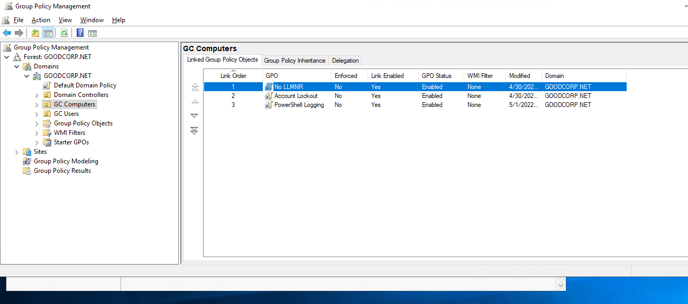
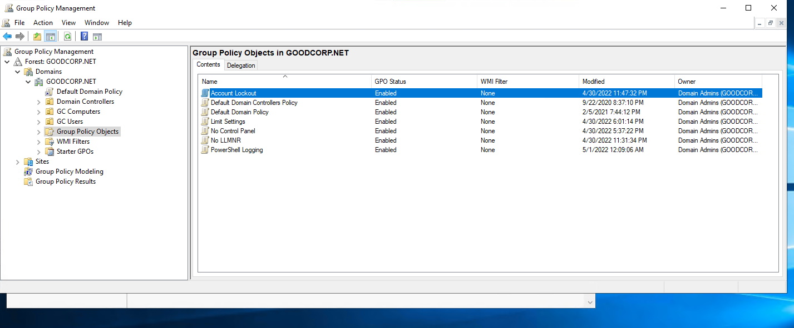
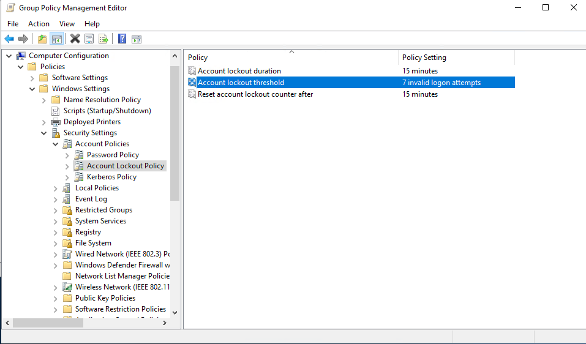
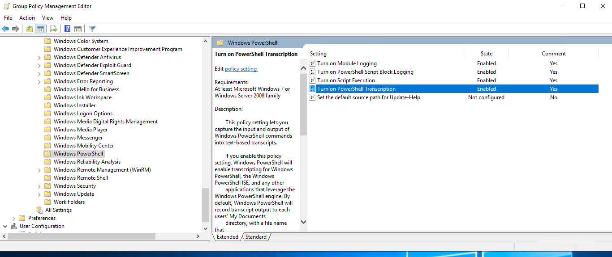
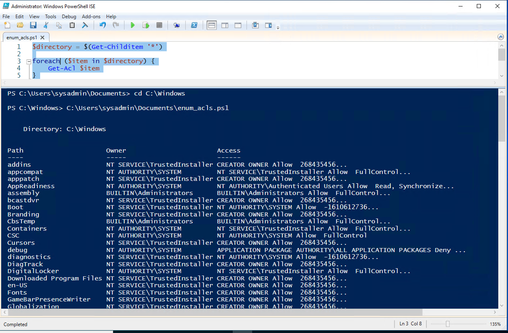

## Week 7 Homework Submission File: Windows Administration and Hardening

---

### Task 1: Take a screenshot of all the GPOs created for this homework assignment. 

    Screenshot for deliverable of Task 1

---

### Task 2: Submit a screenshot of the different Account Lockout policies in Group Policy Management Editor. It should show the three values you set under the Policy and Policy Setting columns.

    Screenshot for deliverable of Task 2

---

### Task 3: Submit a screenshot of the different Windows PowerShell policies within the Group Policy Management Editor. Four of these should be enabled.

    Screenshot for deliverable of Task 3

---

### Task 4: Submit a copy of your enum_acls.ps1 script.

    Script below:
    $directory = $(Get-Childitem '*')

    foreach ($item in $directory) {
    Get-Acl $item
    }

---

### Bonus Task 5: Submit a screenshot of the contents of one of your transcribed PowerShell logs or a copy of one of the logs.

---

© 2022 Trilogy Education Services, a 2U, Inc. brand. All Rights Reserved.
