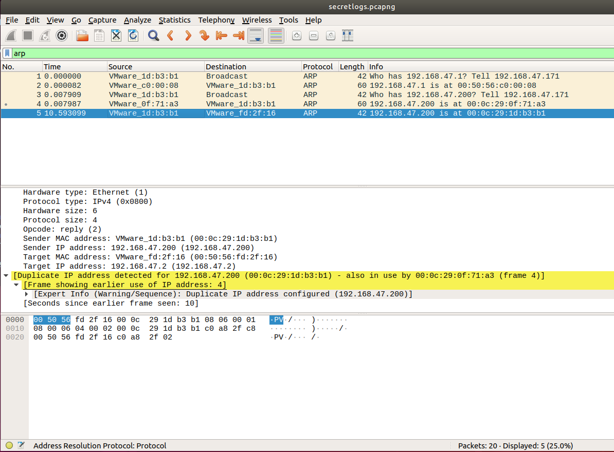

## Week 8 Homework Submission File: Networking Fundamentals

---

## Phase 1: Ping

    
    I used fping to determine which servers are accepting connections:

    fping 15.199.95.91 15.199.94.91 203.0.113.32 161.35.96.20 192.0.2.0

    IP address 161.35.96.20 is accepting connections when it shouldn't be.
    To prevent this the ICMP settings need to be changed.
    This issue would be on OSI layer 3 as that layer handles IP addresses.
    

---

## Phase 2: Syn Scan

    Command to run SYN SCAN:
    sudo nmap -sS 161.35.96.20

    Port 22 is open to TCP protocol and SSH service.
    A firewall or two factor authentication should be here.
    SYN SCAN runs on OSI layer 4.

---

## Phase 3: DNS

    Command to log in:
    ssh jimi@161.35.96.20

    Commands to investigate Rollingstone.com:
    cd etc
    nano hosts

    command to look up ip domain:
    nslookup 98.137.246.8

    The domain name is unknown.yahoo.com. 
    A hacker has been here to poison the DNS.
    Adding an DNS filter might help future poisoning.
    This DNS is part of Layer 7 on the OSI.

---

## Phase 4: ARP

    ssh jimi@161.35.96.20 to log back in

    text in the packetcaptureinfo.txt
    https://drive.google.com/file/d/1ic-CFFGrbruloYrWaw3PvT71elTkh3eF/view?usp=sharing

    Using Wireshark, determined that there was an local IP that was being duplicated in the ARP search and in the HTTP search found a conversation of the hacker contacting Hi Got The Blues Corp.

    The Arp level intrusion is in between level 2 and 3 on the OSI and the HTTP is on layer 7 at the application level.

---

© 2022 Trilogy Education Services, a 2U, Inc. brand. All Rights Reserved.
