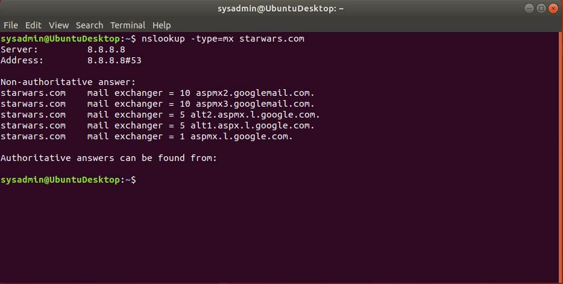
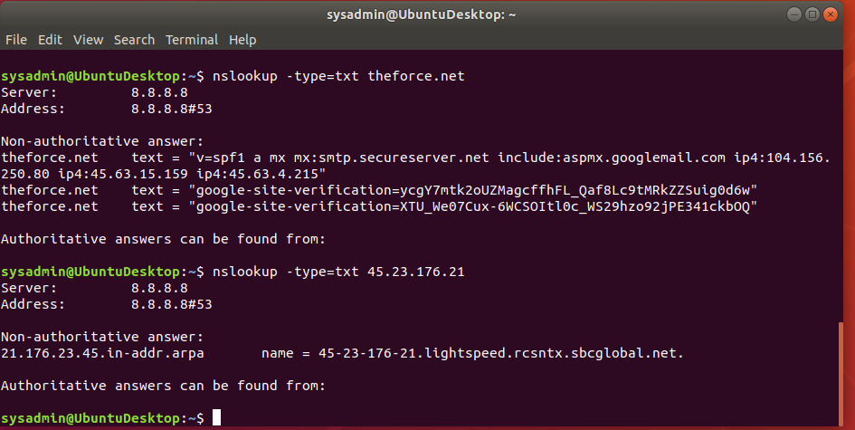
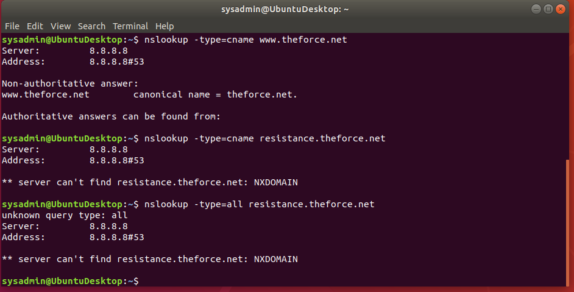
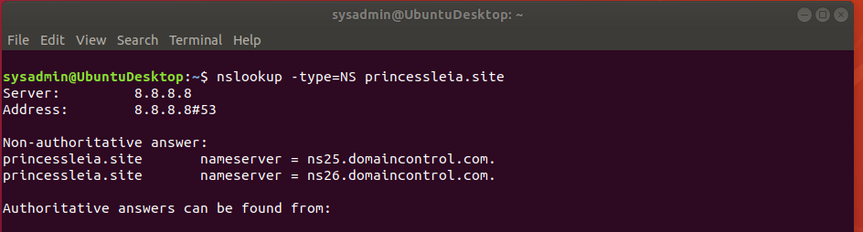
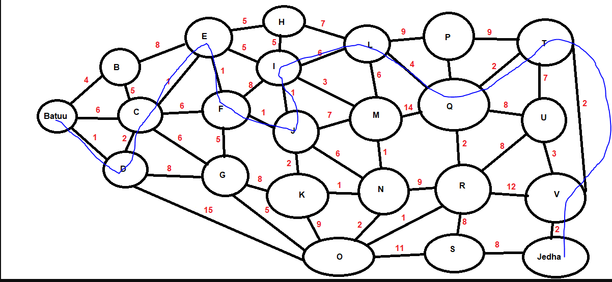
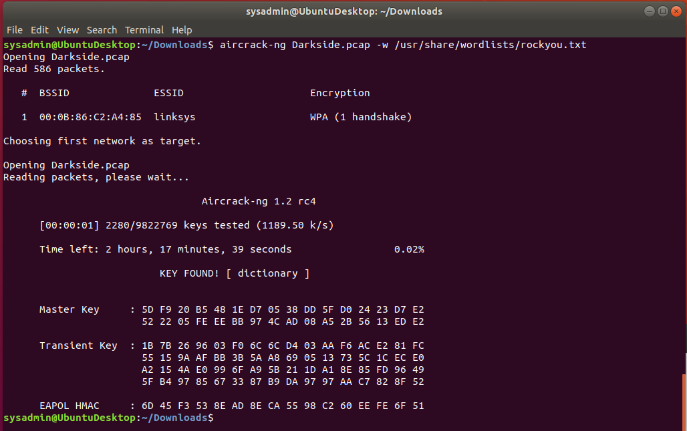
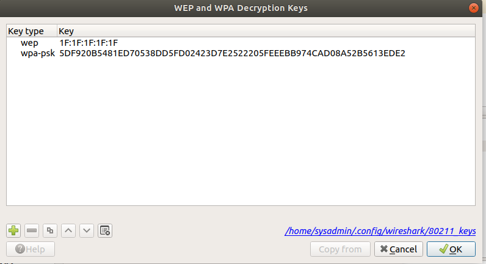
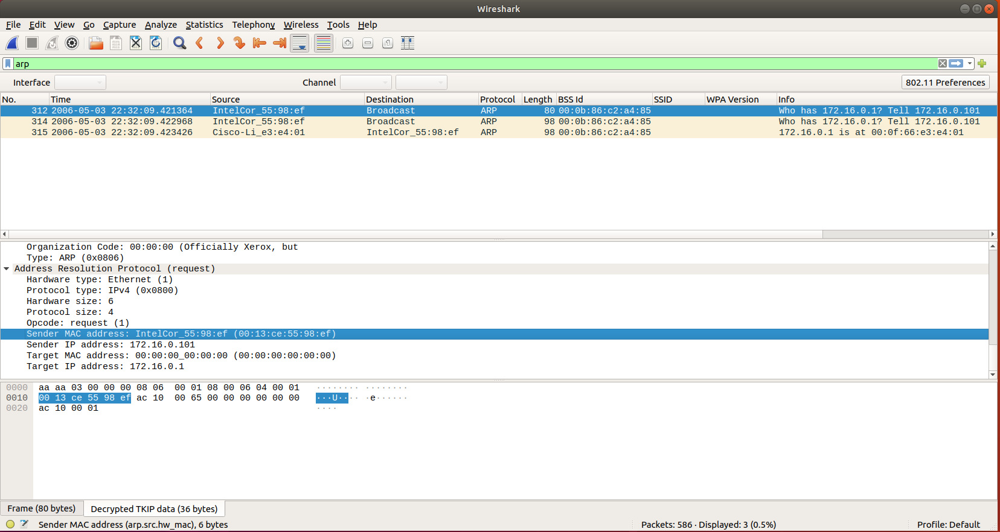
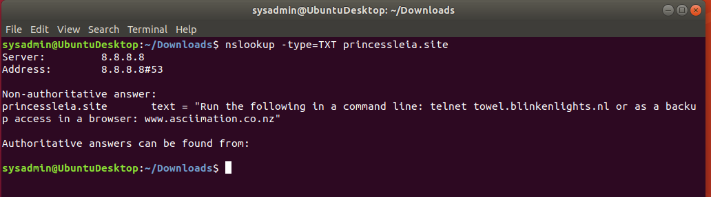
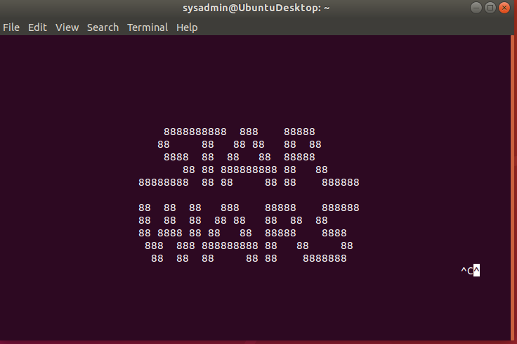

## Week 9 Homework Submission File: Networking Fundamentals II

---

## Mission 1

    Command used in this mission:
    nslookup -type=mx starwars.com

    
    The resistance is not recieving any mail cause the new servers are not listed on the MX record page for their domain account. 
    To fix the issue they need to add asltx.l.google.com and asltx.2.google.com to their MX record page. 
    An example of what it should look like after a nslookup is as follows:

    starwars.com	mail exchanger = 10 aspmx2.googlemail.com.
    starwars.com	mail exchanger = 10 aspmx3.googlemail.com.
    starwars.com	mail exchanger = 5 alt2.aspmx.l.google.com.
    starwars.com	mail exchanger = 5 alt1.aspx.l.google.com.
    starwars.com	mail exchanger = 1 aspmx.l.google.com.
    starwars.com    mail exchanger = 5 asltx.1.google.com.
    starwars.com    mail exchanger = 1 asltx.2.google.com.

---

## Mission 2

    Commands used for this mission:
    nslookup -type=txt theforce.net
    nslookup -type=txt 45.23.176.21

    

    The Force's emails are going to spam cause the new IP address is not on the SPF list in the screenshot above. 
    To fix the issue the line should be changed to the following:

    theforce.net	text = "v=spf1 a mx mx:smtp.secureserver.net include:aspmx.googlemail.com ip4:104.156.250.80 ip4:45.63.15.159 ip4:45.63.4.215 ip4:45.23.176.21"

---

## Mission 3

    Commands used for this mission:
    nslookup -type=cname www.theforce.net
    nslookup -type=cname resistance.theforce.net

    resistance.theforce.net is not being redirected cause it's not listed in the CNAME for theforce.net. 
    To fix this issue, under the Non-authoritative answer there should be a line that reads:

    www.theforce.net	      canonical name = resistance.theforce.net.

    This can be fixed by adding a CNAME record to their DNS host.

---

## Mission 4

    Commands used for this mission:
    nslookup -type=NS princessleia.site

    The backup DNS server is not on the list in the above screenshot does not have ns2.galaxybackup.com on the list. 
    Once it is added to the list there should be a line as follows:

    princessleia.site	nameserver = ns2.galaxybackup.com.

---

## Mission 5

    The best OSPF path while avoiding Planet N is as follows:
    Batuu > D > C > E > F > J > I > L > Q > T > V > Jedha

---

## Mission 6

    Command used in this mission:
    aircrack-ng Darkside.pcap -w /usr/share/wordlists/rockyou.txt

    The Ip address for the Empire are as follows:
    172.16.0.1
    172.16.0.101
    The MAC address are as follows:
    Cisco-Li_e3:e4:01 (00:0f:66:e3:e4:01)
    IntelCor_55:98:ef (00:13:ce:55:98:ef)

---

## Mission 7

    Commands used in mission:
    nslookup -type=TXT princessleia.site
    telnet towel.blinkenlights.nl

---

© 2022 Trilogy Education Services, a 2U, Inc. brand. All Rights Reserved.
